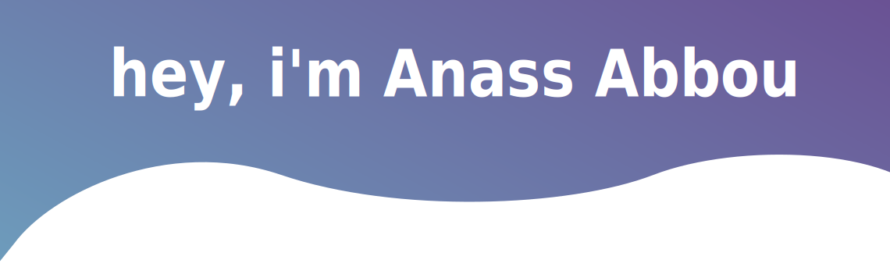

<h3 align="center">
I like experimenting with new technologies, building small projects, and occassionally joining hackathons. ✨
</h3>

- 🌱 I’m currently learning **NextJS, Flutter**

- 💬 Ask me about **Java, Microservices, Js, ES6, React**

- 📫 How to reach me **anass.abbou13@gmail.com**

<h3 align="left">Languages and Tools:</h3>

 
                    

 

  <i>Let's connect and chat! Open to anything under the sun.</i>

  

  

